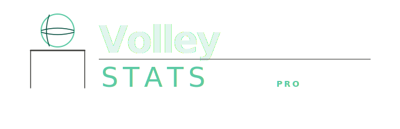

> **Built with [Claude](https://claude.ai/code)** — this project was developed end-to-end using Claude Code as the primary coding assistant.

---

**VolleyStats Pro** is a Windows desktop app for tracking and analysing volleyball matches.
Log actions play-by-play during live matches, then explore stats, heatmaps, and charts per player and team.

## Features

- **Live match tracking** — DataVolley-style action codes, zone selection, real-time dual-side heatmap, rotation bar, sliding player drawer
- **Player profiles** — per-player stat cards and 3-zone heatmaps (attack / serve / reception)
- **Team stats** — aggregated overview, player grid, heatmaps, radar chart vs league baseline
- **Dashboard** — win rate, attack efficiency, top performers, recent form
- **Full CRUD** — manage teams and rosters before the season starts

## Requirements

- Windows 10 / 11 (x64)
- [.NET 8.0 SDK](https://dotnet.microsoft.com/download/dotnet/8.0) — download the **SDK**, not just the runtime

## Quick Start

```bash
# Run (debug)
dotnet run

# Build single-file release .exe
dotnet publish -c Release -r win-x64 --self-contained true -p:PublishSingleFile=true -o ./publish
```

The `.exe` in `./publish/` carries its own runtime and SQLite — copy it anywhere.

## Data Storage

```
%APPDATA%\VolleyStatsPro\volleystats.db
```

Created automatically on first run. No setup required.

## Workflow

1. **Manage Teams** → create teams, add players with jersey numbers and positions
2. **Matches** → schedule a match (or hit **Start Match** in the top bar)
3. **Live Match** → type action codes, pick zones, end rallies and sets
4. **Players / Team Stats / Dashboard** → explore stats after the match

## Action Codes (DataVolley)

```
[a]<number><action>[subtype][zone][result]
```

| Part | Values | Notes |
|------|--------|-------|
| team prefix | *(none)* = home, `a` = away | |
| number | 1–2 digit jersey | |
| action | `S` Serve · `R` Reception · `A` Attack · `B` Block · `D` Dig · `E` Set | |
| serve sub | `H` float · `M` jump-float · `Q` jump · `T` underhand | |
| attack combo | `X1` `X5` `X6` `XP` `V5` `V6` `VP` `PP` … | |
| zone | `1`–`9` | optional |
| result | `#` perfect · `+` positive · `!` overpass · `/` freeball · `-` negative · `=` error | |

**Examples**

```
12SM6#       home #12 jump-float serve, zone 6, perfect
a17R+        away #17 reception, positive
04X52#       home #04 attack X5, zone 2, kill
12SM6.17R+   compound: serve then reception in one line
```

## Zone Layout (FIVB / DataVolley)

```
  Opponent side
  ┌───┬───┬───┐
  │ 4 │ 3 │ 2 │  ← front row
  ├───┼───┼───┤
  │ 5 │ 6 │ 1 │  ← back row
  ├───┼───┼───┤
  │ 9 │ 8 │ 7 │  ← service zone
  └───┴───┴───┘
  Your team (server)
```

## Project Structure

```
VolleyStatsPro/
├── App.xaml / MainWindow.xaml      Shell, global styles
├── Assets/
│   └── logo.svg
├── Models/
│   └── Models.cs                   Entity + stats DTOs
├── Data/
│   └── Database.cs                 SQLite schema, repositories, StatsService
├── Helpers/
│   └── Theme.cs                    Colour palette, fonts, drawing helpers
├── Controls/
│   ├── CourtHeatmapControl.cs      9-zone court heatmap (GDI+)
│   └── Charts.cs                   BarChart + RadarChart
└── Views/
    ├── DashboardView.cs            Season overview, KPI cards, top performers
    ├── PlayersView.cs              Player profiles + heatmaps
    ├── MatchesView.cs              Match list, schedule new match
    ├── LiveMatchView.cs            Live tracking: codes, zones, score
    ├── TeamStatsView.cs            Team stats: grid, heatmaps, radar
    └── ManageTeamsView.cs          CRUD for teams and players
```